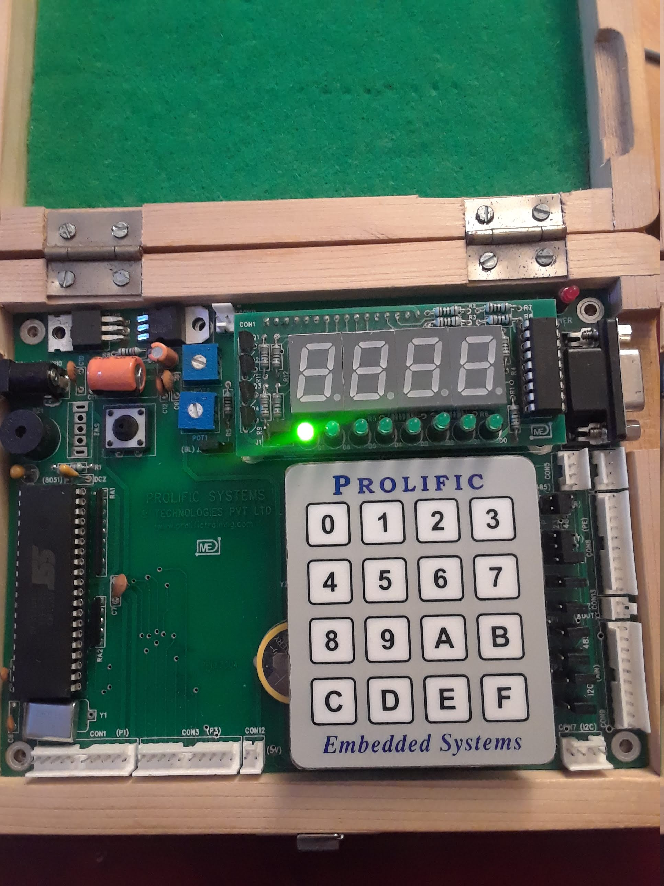

# led_timer_interrupt
Blinks LED using timer interrupt

## Getting Started

### Requirements
* Keil IDE
* Flash Magic
* 8051 microcontroller
* LEDs (x8)

### Installing
1. Connect LEDs to Port 0 of the 8051 microcontroller
1. Open Keil and create new project
   * Choose Philips P89V51RD2 database
1. Add led_timer_interrupt.c file to Source Group
   * Edit TRIGGER constant on line 17 and TH0,TL0 variables in resetTimer0 function to desired values
1. Build target
1. Use Flash Magic to write the resulting hex file to the 8051 microcontroller

### Example

We can turn LED on and off at a rate of one second by configuring TRIGGER and TH0,TL0. Timer 0's 16-bit counting register starts counting at 0x(TH0)(TL0) up to 0xFFFF, at a rate of one count per machine cycle. TRIGGER is the number of times to count from 0x(TH0)(TL0) to 0xFFFF before switching the LED on/off. A machine cycle is the oscillator frequency divided by 12. So the formula we need is: 

0x[TH0][TL0] = 16^4 - (time to delay)*(oscillator frequency)/12.

With an oscillator frequency of 11.0592 MHz, it takes about 71.1 milliseconds for the microcontroller to count from 0x0000 to 
0xFFFF. So we need TH0,TL0 to correspond to a time less than 71.1 milliseconds, and use TRIGGER to multiply that time to our 
desired time. 

To turn LED on and off every second we can configure TH0,TL0 to correspond to a time of 50 milliseconds, and set TRIGGER = 10. The timer will count for 50 millseconds 10 times (=500 milliseconds, or half a second) before switching LED on/off. Using the above formula with (time to delay) = 50 milliseconds and (oscillator frequency) = 11.0592 MHz we get 19,456, which is 4C00 in hex. We set TH0 = 4C, TL0 = 00, and TRIGGER = 10.

The LED blinks on and off every second.

## Authors

* **Sahil Mahajan**

## License

This project intentionally has no license.
